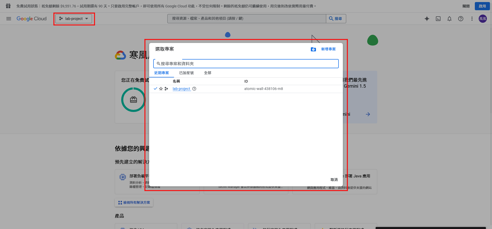
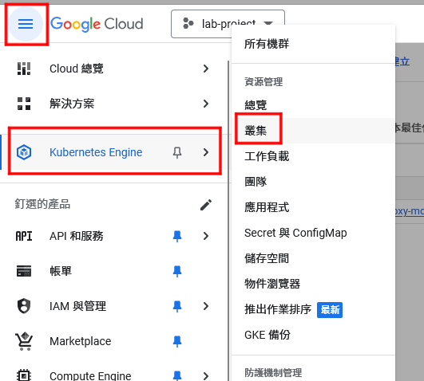
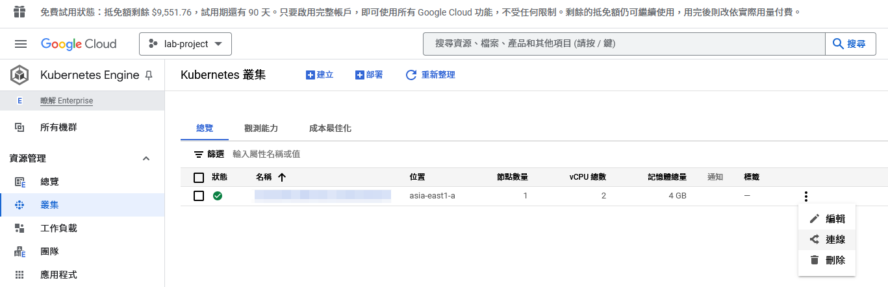
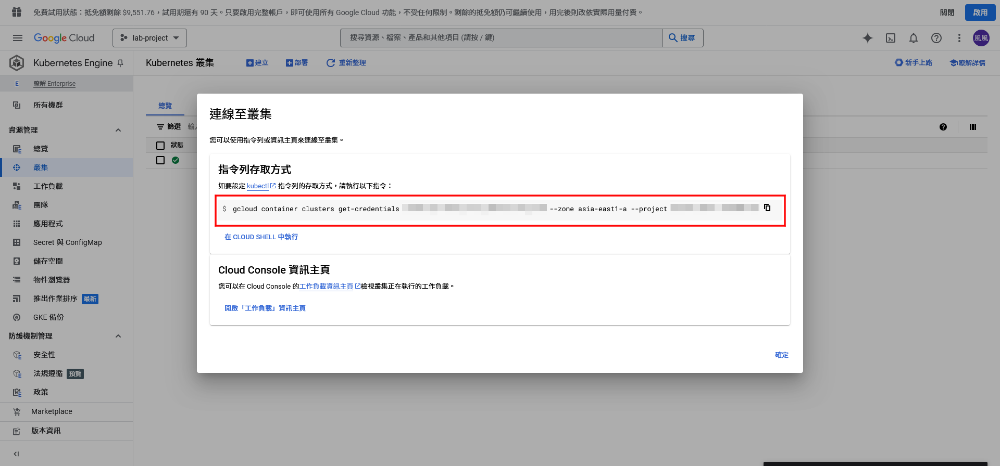
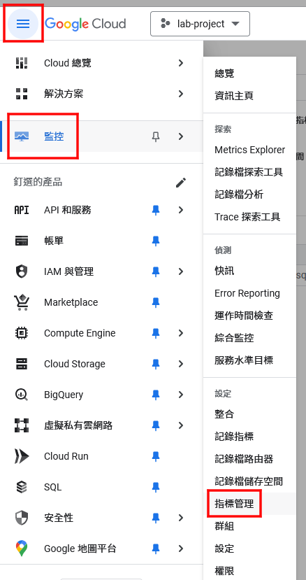
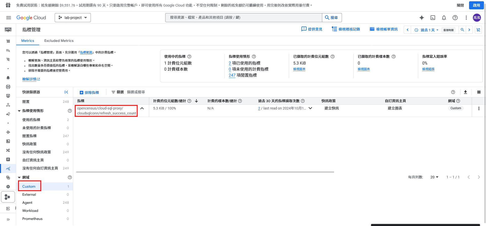

<!-- markdownlint-disable MD028 -->
# Cloud SQL Auth Proxy 輸出監控指標資訊研究

本文件會說明如何啟用 Cloud SQL Auth Proxy 的 Monitoring 功能

Lab 中所使用的應用程式是透過 [samuikaze/dotnet7-core-template](https://github.com/samuikaze/dotnet7-core-template) 模板修改而來，其為一個僅有取得所有使用者資料 API 的簡易應用程式

## Table of Contents

- [前置準備](#前置準備)
- [執行前置準備](#執行前置準備)
  - [Cloud SQL](#cloud-sql)
  - [Google Kubernetes Engine](#google-kubernetes-engine)
  - [服務帳號與 IAM 角色](#服務帳號與-iam-角色)
- [部署應用程式](#部署應用程式)
  - [建置應用程式的映像檔](#建置應用程式的映像檔)
  - [部署相關服務到 GKE 上](#部署相關服務到-gke-上)
- [確認指標是否正常輸出](#確認指標是否正常輸出)
- [已知問題](#已知問題)
- [參考資料](#參考資料)

## 前置準備

- 一個已經啟用 Google Cloud Platform 的帳號
- gcloud 命令列工具

## 執行前置準備

在執行應用程式部署前，應先執行這些步驟將相應的資源先建立起來

> 請注意，由於本範例為 Lab 性質專案，因此各項服務的資源不會開很大，實際使用時請依據需求調整資源大小

### Cloud SQL

- 在專案中啟用 Cloud SQL API
- 依據以下規格建立 Cloud SQL 執行個體

  |項目名稱|規格|
  |---|---|
  |資料庫引擎|PostgreSQL|
  |Cloud SQL 版本|Enterprise / 沙箱環境|
  |資料庫引擎版本|PostgreSQL 14|
  |執行個體名稱|`cloud-sql-auth-proxy-lab`|
  |postgres 帳號的密碼|`cloud-sql-auth-proxy-lab-postgres`|
  |地區|單一可用區 / `asia-east1` (台灣)|
  |機器設定|共用核心 / 1 vCPU，0.614 GB|
  |儲存空間|HDD / 10GB / 不啟用自動增加儲存空間|
  |連線|私人 IP / default|
  |資料保護|全部不勾選|
  |維護|不限 / 任何期間|

- 待其建立完成即可

### Google Kubernetes Engine

本 Lab 是透過 Sidecar 方式將應用程式與資料庫間的連線建立起來，因此需要透過 Google Kubernetes Engine 模擬情境

- 啟用 Google Kubernetes Engine API
- 建立叢集，並從畫面右上角選擇建立 Standard 的叢集
- 依據以下規格建立叢集
  - 基本資訊

    |項目名稱|規格|
    |---|---|
    |名稱|`cloud-sql-auth-proxy-lab`|
    |位置|區域性 / `asia-east1-a`|
    |發佈版本|穩定|

  - 機群註冊

    不勾選

  - 節點集區

    |項目名稱|規格|
    |---|---|
    |集區名稱|`default-pool`|
    |節點數量|1|

    - 節點數

      |項目名稱|規格|
      |---|---|
      |映像檔類型|採用 containerd 的 Container-Optimized OS (cos_containerd) (預設)|
      |機器設定|一般設定 / E2|
      |機器類型|預設 / e2-medium|

    - 節點安全性

      > 依據 [Google 文件](https://cloud.google.com/kubernetes-engine/docs/how-to/hardening-your-cluster?hl=zh-cn#use_least_privilege_sa)的說明，由於 GCE 預設帳戶給予的權限過大，因此較建議自行先建立服務帳號後，再指定必要角色給這個服務帳戶

      > 由於這邊是 Lab 性質專案，因此服務帳戶會直接使用 GCE 預設帳戶

      |項目名稱|規格|
      |---|---|
      |服務帳戶|GCE 預設帳戶|
      |存取權範圍|提供所有 Cloud API 的完整存取權|
      |受防護的選項|勾選啟用完整性監控 / 勾選啟用安全啟動功能 / 不勾選啟用機密 GKE 節點|

  - 網路連線

    |項目名稱|規格|
    |---|---|
    |網路|default / default (10.140.0.0/20)|
    |網路存取權|私人叢集 / 勾選 Access control plane using its external IP address|

  - 安全性

    將以下項目勾選起來

    - 啟用受防護的 GKE 節點
    - 安全防護機制 (基本)
    - 工作負載安全漏洞掃描 (基本)

  - 功能

    - 將「啟用 Managed Service for Prometheus」勾選拿掉

### 服務帳號與 IAM 角色

須建立一支讓 Cloud SQL Auth Proxy 可以進行認證的服務帳號，並指定角色給他

- 建立服務帳號
  > 此名稱可以更換為任意名稱，但請記得此名稱，後續取得金鑰檔案指令中會用到，範例所使用的服務帳號名稱為 `cloud-sql-postgres-gsa`
- 指定 **Cloud SQL 用戶端**角色給此服務帳號

## 部署應用程式

### 建置應用程式的映像檔

在執行部署前，須先將本 Lab 需要的應用程式封裝成映像檔，並上傳到公開或私人的映想檔儲存庫中，請依據以下步驟進行封裝與推送:

- 透過以下其中一個指令執行應用程式的編譯與映像檔的封裝

  > `DOCKER_HUB_USERNAME` 請變更為 Docker Hub 的帳號名稱，或是使用其他的倉庫，也請依據該倉庫的說明將其帳號名稱指定給這個值

  > 此 Lab 的映像檔名稱這邊統一使用 `cloud-sql-auth-proxy-lab`，並透過 Tag 的方式區分建置的版本，你也可以自己定義其名稱，但部署檔中 image 欄位的映像檔名稱請務必跟著修改，否則部署會失敗

  ```bash
  docker build -t DOCKER_HUB_USERNAME/cloud-sql-auth-proxy-lab:v1 -f ./CloudSQLAuthProxy.Lab.Api/Dockerfile . --no-cache
  ```

  ```bash
  podman build -t DOCKER_HUB_USERNAME/cloud-sql-auth-proxy-lab:v1 -f ./Dockerfile --no-cache
  ```

  > 透過 Podman 建置映像檔請務必將 Dockerfile 放到專案根目錄中，否則建置會失敗，此為已知問題

- 透過以下其中一個指令登入映像檔倉庫

  > 若映像檔倉庫不為 Docker，請自行指定登入的網址

  ```bash
  docker login
  ```

  ```bash
  podman login
  ```

- 透過以下其中一個指令將映像檔推送到倉庫中

  ```bash
  docker push DOCKER_HUB_USERNAME/cloud-sql-auth-proxy-lab:v1
  ```

  ```bash
  podman push DOCKER_HUB_USERNAME/cloud-sql-auth-proxy-lab:v1
  ```

### 部署相關服務到 GKE 上

- 先透過指令 `kubectl create ns monitoring-labs` 或 `kubectl apply -f ./kubernetes-yamls/namespace.yaml` 建立命名空間
- 透過以下指令取得 GKE 的 kubeconfig 組態

  > `YOUR_GKE_CLUSTER_NAME` 請取代為 GKE 的叢集名稱

  > `YOUR_GKE_ZONE` 請取代為 GKE 叢集的所在地區 ID

  > `YOUR_PROJECT_ID` 請取代為 GKE 叢集所在的專案 ID

  > 這個指令也可以從 Google Cloud Console 中依據以下步驟取得:
  >
  > - 點選左上角選擇專案
  >
  >    
  >
  > - 打開左側選單點選 Google Kubernetes Engine > 叢集
  >
  >    
  >
  > - 點選指定的叢集後方的三個點後，選擇「連線」
  >
  >    
  >
  > - 在**指令列存取方式**中可以看到 GCP 已經幫你把指令組好了，直接複製後貼到命令列中就可以使用
  >
  >    

  ```bash
  gcloud container clusters get-credentials YOUR_GKE_CLUSTER_NAME \
  --zone YOUR_GKE_ZONE --project YOUR_PROJECT_ID
  ```

- 透過以下指令產生 GCP 上服務帳號的金鑰檔案

  > `iam-account` 欄位值請取代為 GCP 服務帳號的完整名稱，可以在 IAM 中的服務帳號區塊查詢到，例: 假設服務帳號的名稱為 `example_service_account`，專案 ID 為 `example-project-id`，則完整服務帳號名稱就會是 `example_service_account@example-project-id.iam.gserviceaccount.com`

  ```bash
  gcloud iam service-accounts keys create ./temps/key.json \
  --iam-account=cloud-sql-postgres-gsa@lab-project.iam.gserviceaccount.com
  ```

- 透過以下指令將金鑰檔案轉換為 GKE 的 Secrets

  > 指令中 `gsa-secret` 可以更換為任意名稱，但請記得此名稱，後續會在部署宣告檔中用到

  > 指令中的 `monitoring-labs` 若在建立 GKE 命名空間時不是使用這個名字，請自行更改為正確的名稱

  ```bash
  kubectl create secret generic gsa-secret \
  --from-file=service_account.json=./temps/key.json \
  -n monitoring-labs
  ```

- 先將 `./kubernetes-yamls/config-maps-and-secrets.yaml` 中的相關資訊編輯成正確的值後，在透過指令 `kubectl apply -f ./kubernetes-yamls/config-maps-and-secrets.yaml` 將設定檔部署到 GKE 上
  > 請注意，Secrets 中的值都是經過 Bash64 編碼過的結果，編輯後請不要忘記在透過 Bash64 編碼，另外請注意換行問題，否則會部署失敗
- 再透過指令 `kubectl apply -f ./kubernetes-yamls/deployment.yaml` 將測試服務部署到 GKE 上

  > 本 Lab 所使用的 Cloud SQL Auth Proxy 映像檔為 `gcr.io/cloud-sql-connectors/cloud-sql-proxy:latest`

  > Cloud SQL Auth Proxy 相關的啟動參數請在 `./kubernetes-yamls/deployment.yaml` 檔中找到 `deployment.yaml` 區塊中的 `spec.template.spec.containers[1].args` 中修改

## 確認指標是否正常輸出

在應用程式正常部署並完成啟動後 10 秒，請依據以下步驟確認指標是否正常輸出:

- 將 Google Cloud Console 切換到 Monitoring > 指標管理頁面

  > 若測編選單找不到此功能，請在上方搜尋框中輸入 `Monitoring` 搜尋

  

- 在**快速篩選器**中選擇 `Custom`，並在右側表格中查詢是否有名稱為 `opencensus/cloud-sql-proxy/cloudsqlconn` 開頭的指標，若有，則表示測試成功，可以在 GCM 上使用這些指標資料了

  

## 已知問題

1. 部署後 Cloud SQL Auth Proxy 會在日誌中輸出 `Failed to export to Stackdriver: rpc error: code = Internal desc = Internal error encountered. Please retry after a few seconds.` 錯誤訊息

    依據此 [GitHub Issue](https://github.com/GoogleCloudPlatform/cloud-sql-proxy/issues/2018) 中的解答描述，此為已知問題，但其並不影響相關資訊的輸出，因此可以忽略此訊息

## 參考資料

- [Support for Metrics and Tracing - GoogleCloudPlatform/cloud-sql-proxy - GitHub](https://github.com/GoogleCloudPlatform/cloud-sql-proxy?tab=readme-ov-file#support-for-metrics-and-tracing)
- [Intermittent errors logged after enabling telemetry - GoogleCloudPlatform/cloud-sql-proxy - GitHub](https://github.com/GoogleCloudPlatform/cloud-sql-proxy/issues/2018)
- [使用者定義的指標概覽](https://cloud.google.com/monitoring/custom-metrics?hl=zh-cn)
- [從 Google Kubernetes Engine 連線到 Cloud SQL](https://cloud.google.com/sql/docs/mysql/connect-kubernetes-engine?hl=zh-cn)
- [從 GKE 工作負載向 Google Cloud API 進行身份驗證](https://cloud.google.com/kubernetes-engine/docs/how-to/workload-identity?hl=zh-cn#console_1)
- [Cloud SQL 部署演示](https://hackmd.io/@xsggt/HyEsaPLqL?print-pdf#/)
- [Securely Accessing Cloud SQL with IAM Authentication: A Step-by-Step Guide](https://medium.com/niveus-solutions/securely-accessing-cloud-sql-with-iam-authentication-a-step-by-step-guide-499887001ef3)
